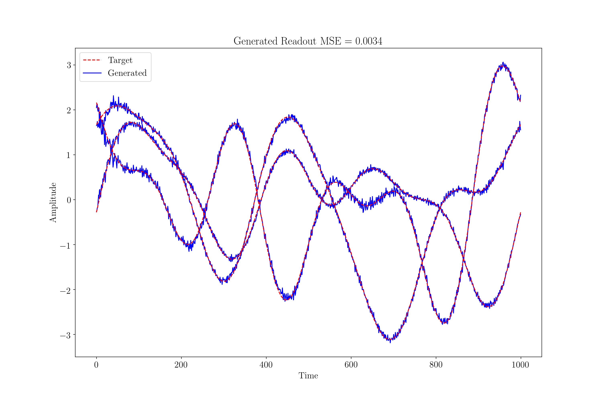
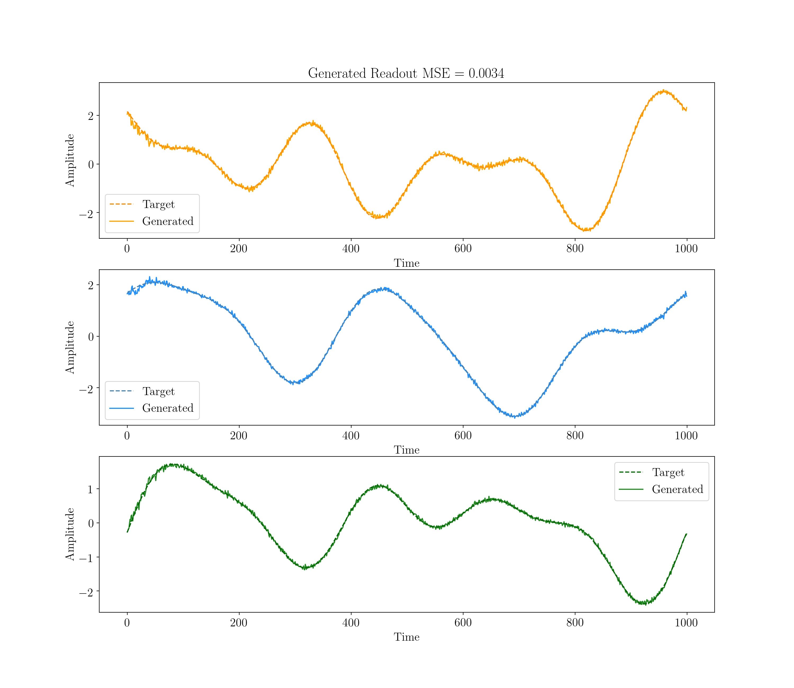

# Kinetic Ising Model (KIM)
This is the Kinetic Ising Model (KIM) repository for code associated to the Master Thesis: "Maximum Likelihood Methods for Biologically Plausible Learning in Recurrent Spiking Networks".

## External Dependences
For correct execution the program requires:
```
numpy
tqdm
```

## How to Run the Code
To execute the code simply run:

```python maas.py```

## Results for Pattern Generation Task
Here we report the result of our KIM model on the Patter Generation Task.



